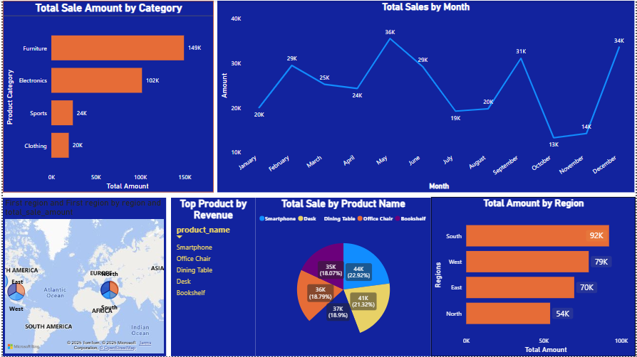

# Sales Data Analysis Project

## Project Overview
This project involves analyzing sales data using **MySQL**, **Python**, and **Power BI** to extract meaningful insights. The data consists of three tables: **sales**, **customers**, and **products**. The goal was to clean and transform the data, then visualize the results using an interactive dashboard.

## Dataset Information

### Customer Table
- **customer_id**: Unique identifier for each customer
- **name**: Customer's name
- **gender**: Gender of the customer
- **age**: Customer's age
- **address**: Residential address
- **registration_date**: Date when the customer registered

### Sales Table
- **sale_id**: Unique sale identifier
- **product_id**: Identifier for the product
- **customer_id**: Identifier for the customer
- **quantity**: Quantity of products sold
- **total_amount**: Total sale amount (calculated)
- **sale_date**: Date of the sale
- **region**: Region where the sale occurred
- **price**: Product price
- **total_sale_amount**: (quantity × price)

### Product Table
- **product_id**: Unique product identifier
- **product_name**: Name of the product
- **category**: Product category
- **price**: Product price

## Project Steps

### 1. SQL file Data Import
- Imported data into the MySQL database.

### 2. Data Cleaning & Transformation
- Performed data cleaning using Python (**Pandas, NumPy**) to handle missing values, duplicates, and inconsistencies.
- Added a `total_sale_amount` column to the sales table.

### 3. Data Export
- Inserted the cleaned data into MySQL or exported it to an Excel file.

### 4. Data Visualization
- Created an interactive **Power BI** dashboard with visuals including:
  - **Revenue by product category**
  - **Revenue by region**
  - **Monthly revenue trends for 2024**
  - **Top 5 products by revenue**

## Tools Used
- **MySQL** for data storage and querying
- **Python** using **Pandas** and **NumPy** for data cleaning and transformation
- **Power BI** for data visualization

## Conclusion
This project provides actionable insights into sales performance. Feel free to explore the GitHub repository and reach out with any questions!

## Contact
- **LinkedIn**: https://linkedin.com/in/ritikkumarsah
- **GitHub**: https://github.com/ritik7545
